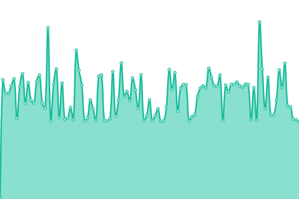
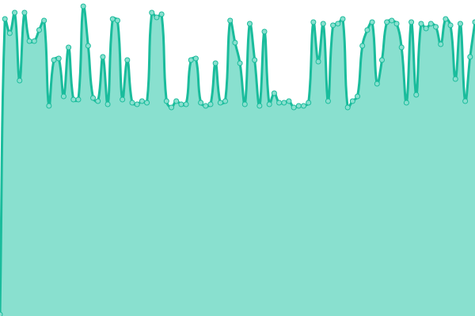
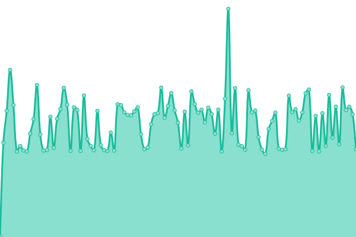

# [📈 Live Status](https://status.pauth.me): <!--live status--> **🟩 All systems operational**

This repository contains the open-source uptime monitor and status page for [msk_z](https://status.pauth.me), powered by [Upptime](https://github.com/upptime/upptime).

With [Upptime](https://upptime.js.org), you can get your own unlimited and free uptime monitor and status page, powered entirely by a GitHub repository. We use [Issues](https://github.com/mskz-ptplus-jp/pauth.me-upptime/issues) as incident reports, [Actions](https://github.com/mskz-ptplus-jp/pauth.me-upptime/actions) as uptime monitors, and [Pages](https://status.pauth.me) for the status page.

<!--start: status pages-->
<!-- This summary is generated by Upptime (https://github.com/upptime/upptime) -->
<!-- Do not edit this manually, your changes will be overwritten -->
<!-- prettier-ignore -->
| URL | Status | History | Response Time | Uptime |
| --- | ------ | ------- | ------------- | ------ |
|  [pauth.me](https://pauth.me) | 🟩 Up | [pauth-me.yml](https://github.com/mskz-ptplus-jp/pauth.me-upptime/commits/HEAD/history/pauth-me.yml) | 

 910ms
     
 | 

<a href="https://status.pauth.me/history/pauth-me">65.89%</a>
    

|  [API](https://pauth.me/api/v1/health) | 🟩 Up | [api.yml](https://github.com/mskz-ptplus-jp/pauth.me-upptime/commits/HEAD/history/api.yml) | 

 162ms
     
 | 

<a href="https://status.pauth.me/history/api">66.37%</a>
    

|  [Demo](https://demo.pauth.me) | 🟩 Up | [demo.yml](https://github.com/mskz-ptplus-jp/pauth.me-upptime/commits/HEAD/history/demo.yml) | 

 757ms
     
 | 

<a href="https://status.pauth.me/history/demo">67.84%</a>
    

<!--end: status pages-->

[**Visit our status website →**](https://status.pauth.me)

## 📄 License

- Powered by: [Upptime](https://github.com/upptime/upptime)
- Code: [MIT](./LICENSE) © [Anand Chowdhary](https://anandchowdhary.com), supported by [Pabio](https://pabio.com)
- Data in the `./history` directory: [Open Database License](https://opendatacommons.org/licenses/odbl/1-0/)
